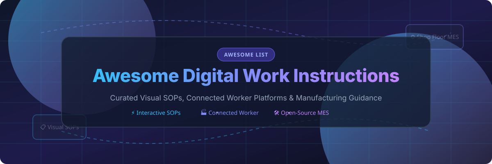

# 🛠️ Awesome Digital Work Instructions

  
  
  
  
  

  

## 🌟 Overview & Top Digital Work Instructions Ecosystem

> **A curated showcase of premier SaaS platforms and open-source GitHub projects for Digital Work Instructions, Visual Standard Operating Procedures (SOPs), Connected Worker platforms, and Shop-Floor guidance systems.**

This repository tracks notable software solutions that replace legacy paper SOPs with interactive, visual, and version-controlled guidance—empowering shop-floor operators with photo annotations, AR assistance, skills verification, and real-time execution analytics.

---

## 📑 Table of Contents

- [📊 Sector Market Overview](#-sector-market-overview)
- [🏢 SaaS & Commercial Platforms](#-saas--commercial-platforms)
- [🔓 Open-Source GitHub Projects](#-open-source-github-projects)
- [🏗️ Architectural Implementation Patterns](#%EF%B8%8F-architectural-implementation-patterns)
- [🤝 How to Contribute](#-how-to-contribute)
- [☕ Support & Sponsorship](#-support--sponsorship)
- [⚠️ Disclaimer](#%EF%B8%8F-disclaimer)
- [📈 Star History](#-star-history)

---

## 📊 Sector Market Overview

> 💡 **Market Insights**: The global Connected Worker & Digital Work Instructions market was estimated at **~$5.2 Billion in 2024** and is projected to reach **$18.5 Billion by 2030** (expanding at a compound annual growth rate of **~23.5%**). The sector is currently **moderately fragmented**—featuring established category leaders such as Tulip, Poka (IFS), and Augmentir alongside specialized SOP authoring vendors and vertical MES solutions. It is not a single winner-take-all market, allowing both commercial suites and composable open-source stacks to thrive across different manufacturing tiers.

---

## 🏢 SaaS & Commercial Platforms

The table below details leading enterprise SaaS platforms for digital work instructions, standard work authoring, and frontline worker connectivity. *Entries are sorted by estimated company valuation/revenue in descending order.*

| Product | Description | Starting Price | Free Tier / Trial Limit | Est. Valuation / Revenue |
| :--- | :--- | :--- | :--- | :--- |
| 🚀 **[Tulip Interfaces](https://tulip.co/)** | No-code frontline operations platform with interactive work instructions, shop-floor apps, quality management, and native IIoT machine connectivity. | $100 / station / month ($1,200/yr) | 14-day full-feature trial (no credit card required) | ~$600M Valuation ($40M ARR) |
| 📘 **[Trainual Manufacturing](https://trainual.com/)** | Playbook and SOP software designed to digitize training processes, standard operating procedures, and shop-floor employee onboarding. | $250 / month (includes up to 10 seats) | 7-day free trial (up to 25 user seats) | ~$150M Valuation ($25M ARR) |
| 🏭 **[Poka](https://www.poka.io/)** (IFS) | Connected-worker ecosystem combining interactive digital work instructions, skills matrices, factory troubleshooting, and frontline chat. | $15 / user / month (Standard plan) | 30-day guided interactive sandbox trial | ~$100M Valuation ($25M ARR) |
| 🧠 **[Augmentir](https://www.augmentir.com/)** | AI-driven connected worker suite offering smart visual work instructions, operational analytics, and automated skill progression tracking. | $12 / user / month (Essentials plan) | 14-day free trial (up to 5 licenses) | ~$50M Valuation ($10M ARR) |
| 📝 **[Dozuki](https://www.dozuki.com/)** | Purpose-built SOP documentation software providing visual assembly guides, strict version control, and ISO compliance tracking. | $299 / month (includes up to 20 users) | 14-day free interactive demo trial | ~$40M Valuation ($8M ARR) |
| 🌐 **[Operations1](https://operations1.com/)** | Adaptive cloud platform for digital worker guidance, interactive work instructions, and intelligent frontline workflow execution. | €29 / user / month (Core tier) | 14-day interactive trial environment | ~$35M Valuation ($7M ARR) |
| 🔍 **[VKS (Visual Knowledge Share)](https://vksapp.com/)** | Visual work instruction app focused on assembly step guidance, shop-floor quality enforcement, and productivity data collection. | $25 / user / month (Lite tier) | 14-day trial (limited to 3 author seats) | ~$25M Valuation ($6M ARR) |
| 📱 **[SwipeGuide](https://www.swipeguide.com/)** | Drag-and-drop visual work instruction software enabling effortless creation of checklists, SOPs, and operator skill modules. | €180 / month (Starter team pack) | 14-day free trial (up to 10 active guides) | ~$20M Valuation ($5M ARR) |
| 🥽 **[Proceedix](https://www.proceedix.com/)** (SymphonyAI) | Enterprise execution platform for digital work instructions, smart glass AR procedures, and field inspection workflows. | $18 / operator / month | 30-day enterprise evaluation trial | ~$18M Valuation ($4M ARR) |
| ⚡ **[Azumuta](https://www.azumuta.com/)** | Modular operator platform linking digital assembly guides, quality assurance checks, and shop-floor issue ticketing. | €15 / user / month (Base tier) | 14-day free trial (full feature access) | ~$15M Valuation ($3M ARR) |
| 🎥 **[Manual.to](https://manual.to/)** | Fast photo and video-first digital instruction builder engineered for frontline operators and field maintenance crews. | $99 / month (Starter package) | 14-day free trial (up to 5 team members) | ~$10M Valuation ($2M ARR) |
| 🎬 **[REWO](https://rewo.io/)** | Visual SOP software leveraging short video snippets and annotated diagrams to train factory operators up to 12x faster. | €149 / month (Standard plan) | 14-day free trial (up to 3 admin seats) | ~$8M Valuation ($1.5M ARR) |

---

## 🔓 Open-Source GitHub Projects

Explore community-driven, self-hosted, and open-source solutions for digital work instructions, MES work order guidance, and SOP wikis. *Entries are sorted by GitHub Star count in descending order.*

1. 🌟 **[Odoo Manufacturing & Quality](https://github.com/odoo/odoo)**  
     
   *Comprehensive open-source ERP featuring work order routing, interactive quality worksheets, shop-floor tablet views, and operator instruction triggers.*

2. 🌟 **[ERPNext Manufacturing](https://github.com/frappe/erpnext)**  
     
   *Flexible open-source enterprise suite with built-in manufacturing modules, Bill of Materials (BOM) management, and workstation step guidance.*

3. 🌟 **[BookStack](https://github.com/BookStackApp/BookStack)**  
     
   *Opinionated, elegant documentation platform widely deployed for organizing hierarchical SOPs, safety instructions, and versioned factory knowledge bases.*

4. 🌟 **[DokuWiki](https://github.com/dokuwiki/dokuwiki)**  
     
   *Ultra-lightweight, file-based open wiki engine popular in industrial facilities for low-maintenance, version-controlled standard work documentation.*

5. 🌟 **[Carbon ERP / MES](https://github.com/crbnos/carbon)**  
     
   *Modern open-source ERP, MES, and QMS system offering digital traveler cards, live factory model synchronization, and step-by-step assembly routines.*

6. 🌟 **[metasfresh ERP](https://github.com/metasfresh/metasfresh)**  
     
   *Open-source enterprise ERP platform with real-time shop-floor execution tracking, production routing, and quality assurance instructions.*

7. 🌟 **[Node-OPCUA](https://github.com/node-opcua/node-opcua)**  
     
   *Full-stack Industrial IoT OPC UA protocol implementation in TypeScript/Node.js used to connect physical machine events with visual work instruction screens.*

8. 🌟 **[Apache OFBiz](https://github.com/apache/ofbiz-framework)**  
     
   *Enterprise automation suite providing open-source Manufacturing Resource Planning (MRP), process routing, and work order execution tools.*

9. 🌟 **[qcadoo MES](https://github.com/qcadoo/mes)**  
     
   *Web-based open-source Manufacturing Execution System tailored for SMB factories to manage work orders, schedules, and step-by-step instructions.*

10. 🌟 **[Open Factory Twin (OFACT)](https://github.com/openfactorytwin/ofact)**  
      
    *Open-source digital twin framework designed to synchronize physical production lines with digital work instruction interfaces and IoT feedback.*

11. 🌟 **[SOP Rocket](https://github.com/dylanpjenkins/sop-rocket)**  
      
    *Open-source desktop app for fast SOP authoring—capturing step screenshots, annotations, and exporting to clean PDF, DOCX, and Markdown files.*

12. 🌟 **[Vision Prep](https://github.com/Azzbo77/Vision-Prep)**  
      
    *Visual step-by-step assembly instruction platform built for modular build steps, annotated photos, progress logging, and live build reporting.*

---

## 🏗️ Architectural Implementation Patterns

Depending on your organization's IT infrastructure and scale, typical deployment strategies include:

- 🎯 **Visual Assembly Guidance**: SOP Rocket or Vision Prep for rapid screenshot & photo-annotated instruction authoring.
- ⚙️ **MES-Integrated Standard Work**: Carbon ERP, OpenMES, or Odoo Manufacturing for tying work orders directly to real-time machine & completion data.
- 📚 **Knowledge Base & Wiki Stacks**: BookStack or DokuWiki for centralized, version-controlled document governance across multi-line plants.
- 🔗 **Composable Open Stack**: SOP Authoring → Line Tablet Web Display → OPC UA / Node-OPCUA Machine Triggers → Open MES Analytics.

---

## 🤝 How to Contribute

Contributions are warmly welcomed to keep this awesome list accurate and up-to-date!

1. 🍴 **Fork** this repository.
2. 📝 **Add or update** entries in `README.md` following the established table / badge structure.
3. 🔍 Ensure descriptions are objective, concise, and include exact starting pricing or star badges where appropriate.
4. 📥 Submit a **Pull Request** with a clear explanation of your additions.

Explore more curated awesome repositories at **[Awesome-Awesome-Awesome](https://github.com/ishandutta2007/Awesome-Awesome-Awesome)**!

---

## ☕ Support & Sponsorship

If you find this repository helpful for your engineering, manufacturing, or digital transformation research, please consider supporting the project:

- ⭐ **Star this repository** to increase visibility on GitHub.
- 🔀 **Fork and share** with colleagues, manufacturing engineers, and lean leaders.
- 💖 **Sponsor the Maintainer**: Support continuous updates and project maintenance on [GitHub Sponsors](https://github.com/sponsors/ishandutta2007).

---

## ⚠️ Disclaimer

- This is a **community-curated index** for informational and educational purposes only.
- Digital work instructions directly impact manufacturing safety, product quality, and regulatory compliance. Always maintain strict version control, engineering validation, and audit controls for production environments.
- Open-source tools provide high customizability and low costs, but transfer operational governance and hosting security to your internal team.

---

## 📈 Star History

---

  <b>Made with ❤️ for Manufacturing Engineers, Lean Leaders, &amp; Frontline Operations Teams</b>

